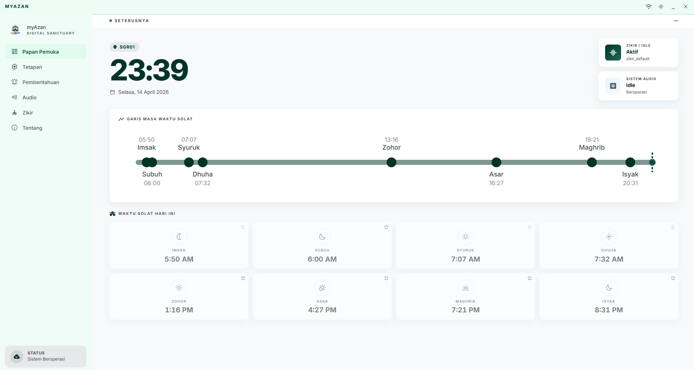
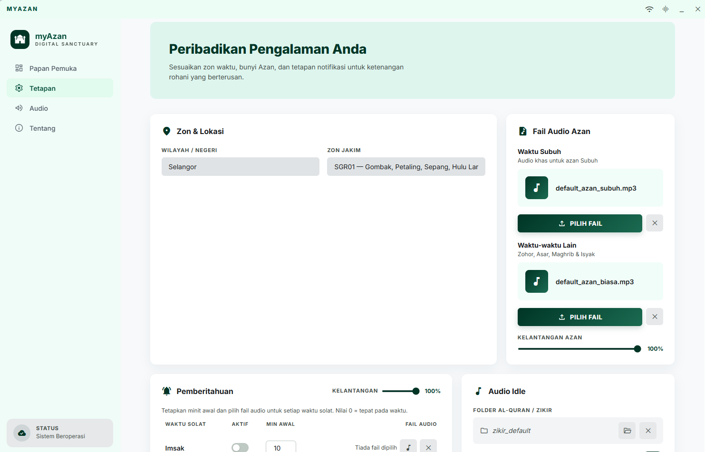
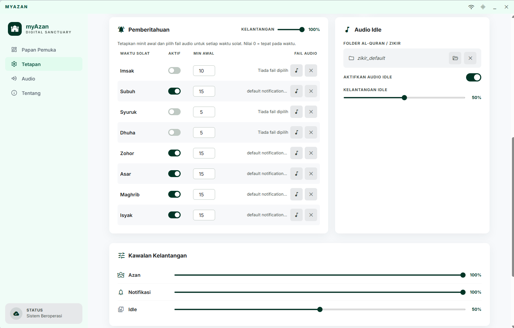

# 🕌 myAzan

Aplikasi desktop **Electron.js** untuk **Windows 10/11** yang memainkan azan secara automatik mengikut zon waktu solat JAKIM, menyokong notifikasi awal, serta memainkan bacaan al-Quran atau zikir ketika sistem berada dalam keadaan idle.

> Direka untuk berjalan **24 jam tanpa gangguan** pada mini PC atau komputer desktop biasa.

---

## 🎯 Objektif

myAzan dibangunkan untuk kegunaan desktop atau mini PC yang berjalan 24 jam, dengan fokus kepada:

- Azan automatik mengikut zon pilihan pengguna
- Notifikasi audio sebelum masuk waktu solat tertentu
- Mod **offline-first** — terus berfungsi tanpa internet selepas data dimuat turun
- Lantunan audio idle (al-Quran / zikir) semasa tiada aktiviti audio lain
- Antara muka pengguna sepenuhnya dalam **Bahasa Melayu**

---

## 📸 Paparan Aplikasi





## ✨ Ciri Utama

| Ciri | Keterangan |
|------|-----------|
| 🔊 Azan Automatik | Memainkan azan tepat pada waktunya mengikut zon JAKIM |
| 🔔 Notifikasi Awal | Bunyi peringatan beberapa minit sebelum masuk waktu |
| 📖 Audio Idle | Lantunan al-Quran / zikir berterusan semasa tiada audio lain |
| 🌐 Offline-First | Berfungsi tanpa internet selepas data tahunan tersimpan |
| 🗺️ 58 Zon JAKIM | Sokongan penuh semua zon seluruh Malaysia |
| 💾 Simpanan Lokal | Data waktu solat disimpan dalam SQLite, tiada bergantung awan |
| 🔁 Kitaran Tahunan | Auto muat turun data tahun baru pada Oktober–Disember |
| 🎚️ Kawalan Kelantangan | Kelantangan berasingan untuk azan, notifikasi, dan idle |
| 🚀 Mula Bersama Windows | Boleh ditetapkan untuk bermula secara automatik ketika Windows dihidupkan |
| 🇲🇾 Bahasa Melayu | Semua UI, butang, dan mesej dalam Bahasa Melayu |

---

## 🗺️ Zon JAKIM Yang Disokong

Aplikasi menyokong **58 zon** merangkumi **14 negeri** seluruh Malaysia:

- Wilayah Persekutuan (WLY01–WLY02) — 2 zon
- Johor (JHR01–JHR04) — 4 zon
- Kedah (KDH01–KDH07) — 7 zon
- Kelantan (KTN01, KTN03) — 2 zon *(tiada KTN02 dalam sistem JAKIM)*
- Melaka (MLK01) — 1 zon
- Negeri Sembilan (NSN01–NSN03) — 3 zon
- Pahang (PHG01–PHG05) — 5 zon
- Perak (PRK01–PRK07) — 7 zon
- Perlis (PLS01) — 1 zon
- Pulau Pinang (PNG01–PNG02) — 2 zon
- Sabah (SBH01–SBH07) — 7 zon
- Sarawak (SRW01–SRW09) — 9 zon
- Selangor (SGR01–SGR04) — 4 zon
- Terengganu (TRG01–TRG04) — 4 zon

---

## ⚙️ Aliran Proses Aplikasi

### 1️⃣ Permulaan Aplikasi (Startup)

Apabila myAzan dibuka, ia menjalankan proses bootstrap secara berperingkat:

```
Buka aplikasi
    │
    ▼
[1] Buka sambungan SQLite & jalankan migrasi pangkalan data
    │
    ▼
[2] Baca tetapan pengguna — dapatkan kod zon aktif
    │
    ├── Tiada zon aktif → langkau sync, tunggu pengguna pilih zon
    │
    └── Ada zon aktif ──────────────────────────────────────────┐
                                                                │
    ▼                                                           │
[3] Semak sama ada data waktu solat zon + tahun ini sudah ada  ◄┘
    │
    ├── Data sudah ada → guna cache lokal, tiada muat turun
    │
    └── Data belum ada → muat turun dari API JAKIM
            │
            ├── Berjaya → simpan dalam SQLite
            └── Gagal   → log amaran, teruskan dengan data sedia ada
    │
    ▼
[4] Mulakan Scheduler (semak waktu setiap 10 saat)
    │
    ▼
[5] Mulakan Audio Engine (3 player berasingan)
    │
    ▼
Aplikasi sedia & berjalan 🟢
```

---

### 2️⃣ Aliran Muat Turun Data Waktu Solat

Data waktu solat diambil dari API JAKIM e-Solat secara tahunan:

```
URL: https://www.e-solat.gov.my/index.php?r=esolatApi/takwimsolat&period=year&zone={zone}
```

**Proses sync data:**

```
syncPrayerTimesForZone(zoneCode)
    │
    ▼
Semak: adakah data zon + tahun SEMASA sudah ada dalam SQLite?
    │
    ├── Ada → teruskan tanpa muat turun (jimat bandwidth)
    │
    └── Tiada → muat turun dari JAKIM API (sehingga 3 percubaan semula)
                    │
                    ▼
                Validasi data:
                - ≥300 rekod wajib ada
                - Format tarikh DD-MMM-YYYY → YYYY-MM-DD
                - Semua waktu fajr, dhuhr, asr, maghrib, isha mesti ada
                    │
                    ▼
                Simpan ke jadual prayer_times dalam SQLite
    │
    ▼
Semak: adakah bulan semasa Oktober–Disember?
    │
    ├── Bukan → selesai
    │
    └── Ya → cuba pra-muat data tahun BERIKUTNYA
              (supaya app terus berfungsi pada 1 Januari)
```

> 💡 **Mengapa pra-muat Oktober–Disember?** Supaya apabila tahun baru bermula, data sudah siap dan azan masih berbunyi walaupun tiada internet.

---

### 3️⃣ Aliran Scheduler (Semakan Waktu Setiap 10 Saat)

Scheduler adalah "jam penyelaras" yang menentukan bila azan atau notifikasi perlu berbunyi:

```
[Setiap 10 saat]
    │
    ▼
Dapatkan masa semasa & tarikh hari ini
    │
    ├── Tarikh berubah? → jalankan proses pertukaran hari:
    │       - sync data waktu solat
    │       - bersihkan log lama (>90 hari)
    │
    ▼
Dapatkan zon aktif & data waktu solat hari ini dari SQLite
    │
    ▼
Untuk setiap waktu solat (imsak, subuh, syuruk, dhuha, zohor, asar, maghrib, isyak):
    │
    ├── [AZAN] Semak: adakah masa semasa dalam tetingkap 60 saat dari waktu azan?
    │       │
    │       ├── Tidak → langkau
    │       │
    │       └── Ya → semak trigger_log: adakah azan ini SUDAH berbunyi hari ini?
    │                   │
    │                   ├── Sudah → elak ulang, langkau
    │                   └── Belum → catat dalam trigger_log, cetuskan event AZAN 🔊
    │
    └── [NOTIFIKASI] Semak: adakah masa semasa dalam tetingkap 60 saat dari (waktu - X minit)?
            │
            ├── Tidak → langkau
            │
            └── Ya → semak trigger_log: adakah notifikasi ini SUDAH berbunyi hari ini?
                        │
                        ├── Sudah → elak ulang, langkau
                        └── Belum → catat dalam trigger_log, cetuskan event NOTIFIKASI 🔔
```

> 🛡️ **Mekanisme anti-ulang:** Setiap trigger yang dicetuskan disimpan dalam `trigger_log`. Sekiranya azan Maghrib telah berbunyi pada hari ini, ia tidak akan berbunyi lagi walaupun komputer disambungkan atau waktu ditetapkan semula.

---

### 4️⃣ Aliran Audio Engine (Sistem 3 Player Berkeutamaan)

myAzan menggunakan **3 player audio berasingan** dengan sistem keutamaan yang ketat:

```
KEUTAMAAN AUDIO:  🥇 Azan  >  🥈 Notifikasi  >  🥉 Idle
```

#### Apabila Azan Dicetuskan

```
Event AZAN diterima dari Scheduler
    │
    ▼
Semak: adakah fail MP3 azan ditetapkan dan wujud?
    │
    ├── Tidak → log amaran, azan tidak dimainkan
    │
    └── Ya ──────────────────────────────────────────┐
                                                      │
    ▼                                                 │
Hentikan Notification Player (jika sedang main)      ◄┘
    │
    ▼
Jeda Idle Player (jika sedang main)
    │
    ▼
Main Azan Player dengan fail:
    - Waktu Subuh  → gunakan fail "Azan Subuh"
    - Waktu lain   → gunakan fail "Azan Selain Subuh"
    │
    ▼
Azan selesai / ralat
    │
    ▼
Sambung semula Idle Player (jika diaktifkan)
```

#### Apabila Notifikasi Dicetuskan

```
Event NOTIFIKASI diterima dari Scheduler
    │
    ▼
Semak: adakah Azan sedang main?
    │
    ├── Ya  → abaikan notifikasi (azan lebih utama)
    │
    └── Tidak ───────────────────────────────────────┐
                                                      │
    ▼                                                 │
Semak: adakah fail MP3 notifikasi ditetapkan?        ◄┘
    │
    ├── Tidak → langkau
    │
    └── Ya ──────────────────────────────────────────┐
                                                      │
    ▼                                                 │
Jeda Idle Player                                     ◄┘
    │
    ▼
Main Notification Player
    │
    ▼
Notifikasi selesai / ralat
    │
    ▼
Sambung semula Idle Player (jika diaktifkan)
```

#### Aliran Idle Audio (al-Quran / Zikir)

```
App dimulakan & idle diaktifkan
    │
    ▼
Baca senarai fail MP3 dari folder yang dipilih
Isih mengikut nama fail (A → Z)
    │
    ▼
Main fail pertama
    │
    ▼
Fail selesai → main fail seterusnya
    │         (jika fail terakhir → kembali ke fail pertama)
    ▼
[Bila diganggu oleh Azan/Notifikasi]
    │
    └── Jeda / hentikan idle
            │
            └── Selepas azan/notifikasi selesai → sambung semula mengikut mod:
                    - restart_playlist → mulakan semula dari fail pertama
                    - restart_track    → ulang semula fail yang sedang main
                    - resume_track     → sambung dari kedudukan semasa
```

---

### 5️⃣ Aliran Pertukaran Hari & Tahun

```
[Scheduler mengesan tarikh berubah]
    │
    ▼
Sync data waktu solat:
    ├── Data hari ini masih sama tahun → terus guna dari cache
    └── Tahun bertukar (1 Jan) → data tahun baru sudah pra-dimuat sebelumnya (Okt–Dis)
    │
    ▼
Bersihkan trigger_log yang lebih lama dari 90 hari
    │
    ▼
Scheduler terus berjalan seperti biasa 🔄
```

---

## 🔧 Ciri Tetapan Pengguna

### 🗺️ Pilihan Zon
- Pengguna memilih negeri & zon dari senarai lengkap 58 zon JAKIM
- Selepas zon ditukar, data waktu solat zon baru dimuat turun secara automatik (jika belum ada)
- Data zon lama **tidak** dipadam, boleh digunakan semula jika zon ditukar balik

### Tetapan Azan 🔊
| Waktu | Fail Audio |
|-------|-----------|
| Subuh | Boleh pilih fail MP3 berasingan |
| Zohor, Asar, Maghrib, Isyak | Gunakan fail "Azan Selain Subuh" |

### Tetapan Notifikasi 🔔
Untuk setiap waktu solat, pengguna boleh:
- ✅ Aktif / nyahaktif notifikasi
- ⏱️ Tetapkan berapa minit **sebelum** waktu untuk notifikasi berbunyi
- 🎵 Pilih fail MP3 notifikasi yang berbeza
- 🔉 Laraskan kelantangan khusus untuk notifikasi itu

Waktu yang disokong untuk notifikasi:

| Waktu | Lalai |
|-------|-------|
| Imsak | Tidak diaktifkan, 10 minit sebelum |
| Subuh (Fajr) | Diaktifkan, 15 minit sebelum |
| Syuruk | Tidak diaktifkan, 5 minit sebelum |
| Dhuha | Tidak diaktifkan, 5 minit sebelum |
| Zohor | Diaktifkan, 15 minit sebelum |
| Asar | Diaktifkan, 15 minit sebelum |
| Maghrib | Diaktifkan, 15 minit sebelum |
| Isyak | Diaktifkan, 15 minit sebelum |

### Tetapan Audio Idle 📖
- Pilih **folder** yang mengandungi fail-fail MP3
- Fail dimainkan mengikut **susunan nama fail** (A → Z)
- Selepas fail terakhir, ulang dari awal secara berterusan
- Boleh aktifkan atau nyahaktifkan sepenuhnya
- 3 mod sambung semula selepas gangguan azan/notifikasi

### Kawalan Kelantangan 🎚️
- Kelantangan **Azan**: 0–100
- Kelantangan **Notifikasi**: 0–100
- Kelantangan **Idle**: 0–100

### Permulaan Automatik 🚀
- Togol **"Mulakan bersama Windows"** — hidupkan untuk myAzan bermula secara automatik apabila Windows dihidupkan
- Sesuai untuk mini PC atau komputer yang sentiasa aktif

---

## 📱 Halaman Aplikasi

Aplikasi myAzan mempunyai **4 halaman utama** yang boleh dinavigasi melalui bar sisi (sidebar) di sebelah kiri skrin:

---

### 🏠 Halaman Utama

Halaman utama dipaparkan secara lalai apabila aplikasi dibuka. Ia menunjukkan dua maklumat penting secara sekilas:

#### 📅 Waktu Solat Hari Ini

- Memaparkan **8 waktu solat** untuk hari semasa: Imsak, Subuh, Syuruk, Dhuha, Zohor, Asar, Maghrib, Isyak
- Setiap waktu dipaparkan bersama **nama dan masa** (format HH:MM)
- **Waktu solat berikutnya** ditonjolkan secara visual supaya mudah dikenal pasti
- Jika zon belum dipilih, mesej arahan akan muncul meminta pengguna pergi ke halaman Tetapan
- Jika data tidak ada secara lokal, sistem akan **cuba muat turun secara automatik** dari API JAKIM

#### 🔊 Status Audio

- Menunjukkan status semasa audio engine: `Idle`, `Azan`, atau `Notifikasi`
- Membantu pengguna mengetahui sama ada sistem sedang memainkan sesuatu audio pada masa itu

---

### ⚙️ Halaman Tetapan

Halaman Tetapan adalah tempat pengguna mengkonfigurasi zon waktu solat dan pilihan permulaan sistem. Ia dibahagikan kepada **2 seksyen utama**:

---

#### 📍 Seksyen 1: Zon Waktu Solat

Pengguna memilih kawasan mereka melalui **2 peringkat pemilihan dropdown**:

| Kawalan | Fungsi |
|---------|--------|
| **Dropdown Negeri** | Pilih negeri dari senarai 14 negeri Malaysia |
| **Dropdown Zon JAKIM** | Pilih zon spesifik dalam negeri tersebut (contoh: `WLY01 — Kuala Lumpur`) |

**Aliran pemilihan zon:**
1. Pengguna pilih negeri → dropdown zon dikemas kini secara automatik
2. Pengguna pilih zon → zon aktif akan disimpan apabila butang **Simpan Tetapan** ditekan
3. Selepas disimpan, sistem semak sama ada data waktu solat untuk zon baru sudah ada
4. Jika belum ada → muat turun secara automatik dari JAKIM, kemudian halaman utama dikemas kini

> 💡 Data zon lama tidak dipadam. Jika pengguna menukar balik ke zon lama yang pernah digunakan, data tersedia serta-merta tanpa muat turun semula.

---

#### 🚀 Seksyen 2: Permulaan Sistem

| Kawalan | Fungsi |
|---------|--------|
| **Togol "Mulakan bersama Windows"** | Apabila diaktifkan, myAzan akan dilancarkan secara automatik setiap kali Windows dihidupkan — sesuai untuk mini PC atau komputer yang sentiasa aktif |

> 💡 Ciri ini menggunakan mekanisme **Login Items** Electron yang menulis ke registry Windows. Ia diaktifkan secara lalai.

---

#### 💾 Butang Simpan Tetapan

Di bahagian bawah halaman Tetapan terdapat butang **"💾 Simpan Tetapan"**:

- Semua perubahan dalam 2 seksyen di atas **hanya disimpan apabila butang ini ditekan**
- Selepas berjaya disimpan, mesej pengesahan hijau ✅ dipaparkan selama 5 saat
- Jika ada ralat (contoh: laluan fail tidak sah), mesej merah ❌ dipaparkan
- Halaman Utama akan **dikemas kini secara automatik** dengan zon dan data terbaru selepas simpan

---

### 🎵 Halaman Audio & Notifikasi

Halaman **Audio & Notifikasi** adalah halaman khusus untuk mengkonfigurasi semua tetapan bunyi. Ia mengandungi:

#### 🔊 Fail Audio Azan

| Tetapan | Keterangan |
|---------|-----------|
| **Azan Subuh** | Fail MP3 khas untuk azan waktu Subuh |
| **Azan Selain Subuh** | Fail MP3 yang digunakan untuk Zohor, Asar, Maghrib, dan Isyak |
| **🔈 Kelantangan Azan** | Gelangsar (slider) 0%–100% untuk laras kelantangan azan |

**Cara pilih fail:**
- Klik butang **"Pilih Fail"** → dialog pemilihan fail Windows dibuka
- Nama fail yang dipilih akan dipaparkan di sebelah butang
- Klik butang **"✕"** untuk memadam pilihan fail (azan tidak akan dimainkan jika tiada fail)

> ⚠️ Jika fail tidak dipilih atau fail tidak lagi wujud di lokasi tersimpan, azan tidak akan dimainkan dan amaran direkodkan dalam log sistem.

---

#### 🔔 Notifikasi Sebelum Waktu Solat

Seksyen ini membolehkan pengguna menetapkan bunyi peringatan **sebelum** masuk waktu solat. Terdapat **8 baris** — satu untuk setiap waktu solat:

**Untuk setiap waktu, pengguna boleh:**

| Kawalan | Fungsi |
|---------|--------|
| **Togol Aktif/Tidak** | Hidupkan atau matikan notifikasi untuk waktu tersebut |
| **Input Minit Awal** | Bilangan minit sebelum waktu solat untuk notifikasi berbunyi (0–60 minit). Jika diisi `0`, notifikasi berbunyi tepat pada waktu solat |
| **🎵 Butang Fail** | Pilih fail MP3 untuk notifikasi waktu tersebut |
| **Butang ✕** | Padam pilihan fail untuk waktu tersebut |
| **🔈 Kelantangan Notifikasi** | Gelangsar kelantangan global untuk semua notifikasi (0%–100%) |

**Contoh konfigurasi tipikal:**

| Waktu | Aktif | Minit Sebelum |
|-------|-------|--------------|
| Imsak | ❌ | 10 minit |
| Subuh | ✅ | 15 minit |
| Syuruk | ❌ | 5 minit |
| Dhuha | ❌ | 5 minit |
| Zohor | ✅ | 15 minit |
| Asar | ✅ | 15 minit |
| Maghrib | ✅ | 15 minit |
| Isyak | ✅ | 15 minit |

> 🛡️ Setiap notifikasi hanya berbunyi **sekali sehari**. Jika notifikasi Zohor telah berbunyi, ia tidak akan berbunyi lagi pada hari yang sama walaupun aplikasi dimulakan semula.

---

#### 📖 Audio Latar (Idle) — al-Quran / Zikir

| Kawalan | Fungsi |
|---------|--------|
| **Pilih Folder** | Dialog pilih folder Windows — pilih folder yang mengandungi fail-fail MP3 |
| **Butang ✕** | Padam pilihan folder |
| **Togol "Aktifkan Audio Idle"** | Hidupkan atau matikan fungsi audio idle |
| **🔈 Kelantangan Idle** | Gelangsar kelantangan untuk audio idle (0%–100%) |

**Cara kerja audio idle:**
1. Semua fail `.mp3` dalam folder dipilih dan disusun mengikut **nama fail (A→Z)**
2. Fail pertama mula dimainkan apabila aplikasi dimulakan dan idle diaktifkan
3. Apabila satu fail selesai, fail seterusnya dimainkan secara automatik
4. Apabila fail terakhir selesai, senarai berulang semula dari fail pertama

**3 Mod Sambung Semula selepas Azan/Notifikasi:**

| Mod | Tingkah Laku |
|-----|-------------|
| `restart_playlist` | Kembali ke fail pertama dalam senarai (lalai) |
| `restart_track` | Ulang semula fail yang sedang dimainkan dari awal |
| `resume_track` | Sambung semula tepat dari kedudukan yang terputus |

---

### 👩‍💻 Halaman Tentang

Halaman Tentang memaparkan maklumat tentang aplikasi dan pembangunnya dalam format kad yang tersusun:

---

#### 🧑‍💻 Kad Pembangun

| Maklumat | Nilai |
|----------|-------|
| **Nama** | Fara Farizul |
| **Jawatan** | Pembangun Utama |
| **✉️ Emel** | farxpeace@gmail.com (pautan `mailto:`) |
| **📞 Telefon** | +60137974467 |

---

#### 🖥️ Kad Maklumat Perisian

| Maklumat | Nilai |
|----------|-------|
| **Aplikasi** | myAzan |
| **Versi** | 0.1.0 |
| **Status Lesen** | Proprietari |

---

#### 🎯 Seksyen Objektif Projek

Memaparkan huraian ringkas tentang tujuan pembangunan myAzan — iaitu untuk memudahkan umat Islam menunaikan solat tepat pada waktunya menggunakan data waktu solat JAKIM yang boleh berfungsi tanpa internet.

---

#### ⚠️ Notis Lesen

Memaparkan notis proprietary yang menjelaskan bahawa perisian ini adalah hakmilik Fara Farizul dan tidak boleh diedarkan atau diubah suai tanpa kebenaran.

---

#### 📋 Footer Hak Cipta

- `Hak Cipta Terpelihara © [Tahun Semasa] Fara Farizul`
- `Direka dengan penuh ketelitian di Malaysia.`

---

## ⚙️ Tetapan Lalai (Default Settings)

Berikut adalah nilai lalai yang digunakan oleh myAzan selepas pemasangan baru, seperti yang ditetapkan dalam fail migrasi pangkalan data:

### Tetapan Umum (`app_settings`)

| Kunci | Nilai Lalai | Keterangan |
|-------|------------|-----------|
| `active_zone_code` | `SGR01` | Zon aktif lalai — Gombak, Petaling, Sepang, Hulu Langat, Hulu Selangor, Shah Alam |
| `idle_enabled` | `false` | Audio idle dimatikan secara lalai |
| `auto_download_next_year` | `true` | Auto muat turun data tahun berikutnya pada Oktober–Disember |
| `launch_on_startup` | `true` | Bermula bersama Windows secara automatik |

### Tetapan Audio (`audio_settings`)

| Tetapan | Nilai Lalai | Keterangan |
|---------|------------|-----------|
| `azan_subuh_file_path` | `NULL` | Tiada fail lalai — perlu dipilih oleh pengguna |
| `azan_other_file_path` | `NULL` | Tiada fail lalai — perlu dipilih oleh pengguna |
| `idle_folder_path` | `NULL` | Tiada folder lalai — perlu dipilih oleh pengguna |
| `idle_enabled` | `0` (mati) | Audio idle dimatikan secara lalai |
| `idle_resume_mode` | `restart_playlist` | Mulakan semula dari fail pertama selepas gangguan |
| `idle_sort_mode` | `filename_asc` | Isih fail mengikut nama (A → Z) |
| `azan_volume` | `100` | Kelantangan azan — 100% |
| `notification_volume` | `100` | Kelantangan notifikasi — 100% |
| `idle_volume` | `50` | Kelantangan audio idle — 50% |

### Tetapan Notifikasi (`notification_settings`)

| Waktu | Aktif Lalai | Minit Sebelum Lalai |
|-------|------------|-------------------|
| Imsak | ❌ Tidak | 10 minit |
| Subuh (Fajr) | ✅ Ya | 15 minit |
| Syuruk | ❌ Tidak | 5 minit |
| Dhuha | ❌ Tidak | 5 minit |
| Zohor (Dhuhr) | ✅ Ya | 15 minit |
| Asar | ✅ Ya | 15 minit |
| Maghrib | ✅ Ya | 15 minit |
| Isyak (Isha) | ✅ Ya | 15 minit |

> 💡 Semua tetapan boleh diubah suai melalui halaman **Tetapan** dan **Audio & Notifikasi** dalam aplikasi.

---

## 💾 Struktur Data (Pangkalan Data SQLite)

myAzan menyimpan semua data secara lokal:

| Jadual | Fungsi |
|--------|--------|
| `zones` | Senarai 58 zon JAKIM dengan nama negeri |
| `prayer_times` | Cache data waktu solat tahunan dari JAKIM |
| `app_settings` | Tetapan umum (zon aktif, dll.) |
| `audio_settings` | Laluan fail azan, folder idle, mod sambung semula |
| `notification_settings` | Tetapan per-waktu untuk notifikasi |
| `trigger_log` | Log sejarah azan/notifikasi yang telah dimainkan (90 hari) |

> 📁 Hanya **laluan fail** yang disimpan dalam database, bukan kandungan MP3.

---

## 📡 Sumber Data Waktu Solat

Aplikasi menggunakan API tahunan JAKIM e-Solat:

```
https://www.e-solat.gov.my/index.php?r=esolatApi/takwimsolat&period=year&zone={zone}
```

Contoh kod zon:
- `WLY01` — Kuala Lumpur & Putrajaya
- `SGR01` — Gombak, Hulu Langat, Sepang (Selangor)
- `JHR01` — Pulau Aur, Pulau Pemanggil (Johor)
- `KTN01` — Kota Bharu (Kelantan)

Data yang diterima mengandungi waktu harian untuk:
**Imsak · Subuh · Syuruk · Dhuha · Zohor · Asar · Maghrib · Isyak**

---

## 🚀 Persediaan & Pemasangan

### Keperluan Sistem (Windows)

Sebelum menjalankan `npm install`, pastikan perkara berikut telah dipasang:

1. **Node.js** — muat turun dari [nodejs.org](https://nodejs.org) (cadangan: LTS terbaru)
2. **Python 3.x** — diperlukan oleh `better-sqlite3` untuk kompilasi modul natif
3. **Visual Studio Build Tools** dengan komponen **"Desktop development with C++"**
   - Muat turun dari [visualstudio.microsoft.com/visual-cpp-build-tools](https://visualstudio.microsoft.com/visual-cpp-build-tools/)

### Langkah Pemasangan

```bash
# 1. Clone repositori
git clone <url-repositori>
cd myazan

# 2. Pasang semua kebergantungan
npm install

# 3. Jalankan aplikasi dalam mod pembangunan
npm start
```

> **Nota:** `npm install` akan memuat turun binari Electron (~150 MB) dan membina `better-sqlite3` untuk Electron. Proses ini mungkin mengambil masa beberapa minit.

### 🛠️ Perintah Berguna Semasa Pembangunan

| Perintah | Fungsi |
|---------|--------|
| `npm start` | Kompil + lancarkan Electron (mod biasa) |
| `npm run dev` | Mod pembangunan dengan **hot-reload** — kompil semula secara automatik apabila kod berubah |
| `npm run compile` | Kompil sahaja (tanpa lancarkan Electron) |
| `npm run typecheck` | Semak jenis TypeScript tanpa kompil |
| `npm run lint` | Jalankan ESLint untuk semak kualiti kod |
| `npm run format` | Format kod automatik menggunakan Prettier |

### Membina Pemasang Windows

```bash
npm run build
```

Pemasang NSIS dan fail EXE mudah alih akan dihasilkan dalam folder `dist-build/`.

---

## 📁 Struktur Projek

```
src/
  main/
    bootstrap/         ← inisialisasi app
    database/
      migrations/      ← fail SQL migrasi
      repositories/    ← operasi CRUD per-jadual
    services/
      prayer-time/     ← JAKIM client, parser, sync
      audio/           ← audio engine (3 player + coordinator)
      scheduler/       ← semakan waktu & trigger event
      settings/        ← baca/simpan konfigurasi
      zones/           ← urus senarai zon
    ipc/               ← pendaftaran saluran IPC
  preload/             ← bridge selamat antara main & renderer
  renderer/            ← UI (HTML, TypeScript, CSS)
  shared/
    types/             ← jenis data dikongsi
    constants/         ← pemalar app
```

---

## 🔒 Prinsip Keselamatan & Reka Bentuk

- **contextIsolation: true** — renderer tidak boleh akses terus Node.js API
- **nodeIntegration: false** — keselamatan Electron terjaga
- **Offline-first** — app berfungsi walaupun internet tidak tersedia
- **Trigger anti-ulang** — `trigger_log` memastikan azan/notifikasi tidak berbunyi berganda pada hari yang sama
- **Validasi laluan** — semua laluan fail/folder disahkan wujud sebelum digunakan
- **Validasi data API** — respon JAKIM disemak format dan jumlah rekod sebelum disimpan

---

## 📜 Status Lesen

Perisian ini adalah **Proprietary Software**.

- Kod sumber adalah sulit dan tidak dibenarkan untuk diedarkan atau diubah suai tanpa kebenaran pemilik.
- Aplikasi dalam bentuk binari boleh digunakan secara percuma tertakluk kepada syarat pemilik.

---

## 👩‍💻 Tentang Pembangun

myAzan dibangunkan oleh **Fara Farizul** dengan niat untuk memudahkan umat Islam menunaikan solat tepat pada waktunya, tanpa perlu bergantung kepada aplikasi awan atau sambungan internet yang berterusan. 🤲

> Maklumat lanjut pembangun boleh dilihat dalam aplikasi melalui halaman **Tentang** (🧑‍💻 Kad Pembangun).
